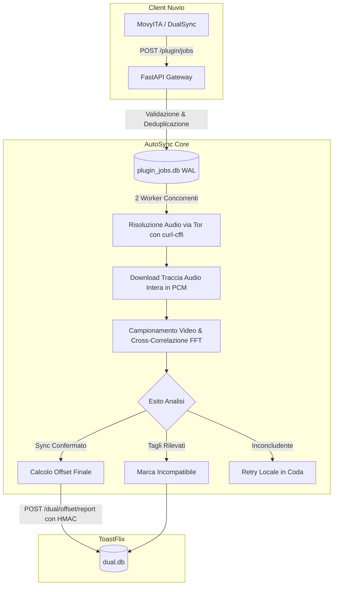

# AutoSync

Servizio autonomo e leggero per la misurazione automatica e resiliente degli offset audio/video per i plugin **PriSynx** (MovyITA, DualSync) e **ToastFlix**.

Non gestisce streaming o playback: il suo compito esclusivo è calcolare con precisione millimetrica l'offset temporale e il rate tra sorgenti video e tracce audio, salvando il risultato in `dual.db`.

---

## 🏗️ Architettura



---

## ⚡ Caratteristiche Principali

1. **Motore di Precisione (v2 Offset Engine)**:
   - **Download integrale della traccia audio** decodificata in PCM mono 8kHz 16-bit.
   - **Estrazione della busta logaritmica a 100 Hz** con normalizzazione z-score.
   - **Cross-correlazione FFT su finestre da 15–30s** con raffinamento parabolico sub-centisecondo.
   - **Verifica su 7 punti equidistanti** (20% – 80% della durata del video).
   - **Test automatico di framerate cinematografici** (PAL, NTSC, Cinema 23.976 / 24 / 25 fps).
   - **Rilevamento silenzio e pause** (RMS) con scorrimento dinamico delle ancore.

2. **Risoluzione Audio Server-Side via Tor (`vx_extractor`)**:
   - Bypass delle protezioni Cloudflare e dei token HLS legati all'IP del client tramite `curl_cffi` (TLS Chrome 124).
   - Risoluzione dinamica del dominio tramite `VX_BASE_URL` o lista domini remota.

3. **Coda Concorrente & Scalabilità (SQLite WAL)**:
   - **Multi-Worker configurabile** (`AUTOSYNC_WORKERS=2` di default) per non saturare la CPU.
   - **Deduplicazione deterministica** su `(media_key, provider, audio_source, video_duration)`.
   - **Priorità automatica**: titoli più richiesti dagli utenti scalano la coda.

4. **Integrazione Sicura con ToastFlix**:
   - Autenticazione delle chiamate in ingresso tramite header segreto `X-PriSynx-Key`.
   - Firma HMAC SHA-256 (`d0a445e...`) per la registrazione certificata degli offset in `dual.db`.
   - Sovrascrittura trasparente di vecchie incompatibilità inesatte.

---

## 📡 Endpoint API

| Metodo | Endpoint | Descrizione |
|---|---|---|
| `GET` | `/health` | Healthcheck del servizio (`200 OK`) |
| `POST` | `/plugin/jobs` | Invia flussi per la misurazione (richiede `X-PriSynx-Key`) |
| `GET` | `/plugin/jobs/status?media_key=...` | Stato attuale dell'elaborazione per un titolo |
| `GET` | `/plugin/jobs/{job_key}` | Dettagli completi del singolo job |
| `GET` | `/plugin/queue` | Dashboard web della coda (protetta da `X-Admin-Key`) |

---

## ⚙️ Variabili d'Ambiente

| Variabile | Default | Descrizione |
|---|---|---|
| `AUTOSYNC_WORKERS` | `2` | Numero di worker paralleli per l'elaborazione |
| `AUTOSYNC_PORT` | `8095` | Porta di ascolto del servizio |
| `PRISYNX_SECRET` | `""` | Chiave segreta condivisa con i plugin Nuvio |
| `TOASTFLIX_URL` | `https://toastflix.stremio-italia.eu` | Istanza ToastFlix di destinazione |
| `OFFSET_API_ACCESS` | `""` | Password o token HMAC per l'accesso a `dual_offsets` |
| `AUTOSYNC_PROXY` | `""` | Proxy Tor/SOCKS5 (es. `socks5://tor-toast-1:9050`) |
| `VX_BASE_URL` | `""` | URL base opzionale per il provider audio VX |
| `PLUGIN_ADMIN_KEY` | `""` | Chiave di accesso per visualizzare `/plugin/queue` |

---

## 🚀 Avvio Rapido con Docker

```bash
docker compose up -d
```

### Esecuzione dei Test

```bash
pytest tests/ -v
```
