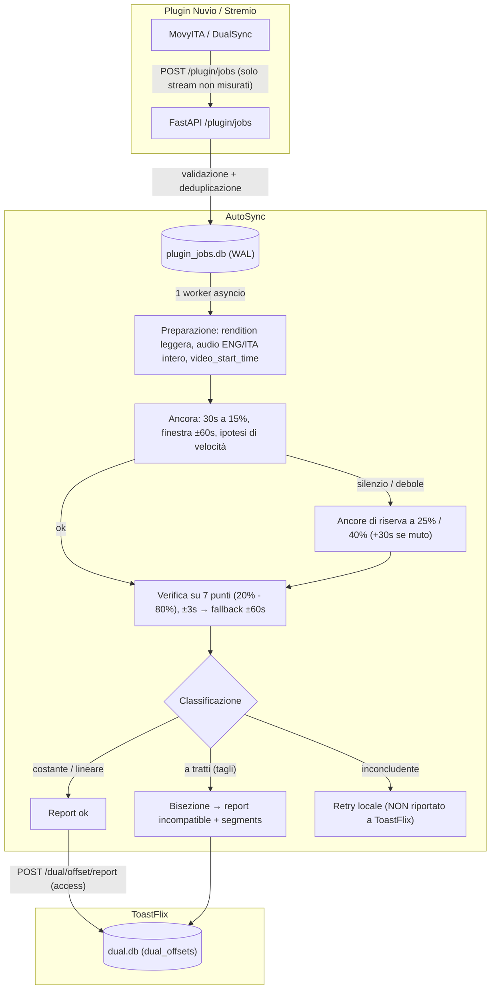

# AutoSync

Servizio dedicato e leggero per la misurazione automatica e resiliente degli offset audio/video per i plugin PriSynx (MovyITA, DualSync) e ToastFlix.

**AutoSync** è un microservizio autonomo dedicato alla sincronizzazione audio/video. Non gestisce playback o proxy di streaming: il suo compito esclusivo è calcolare con precisione millimetrica l'offset e il rate tra la traccia video e la traccia audio e comunicare il risultato a ToastFlix.

---

## Architettura e Funzionamento



---

## Caratteristiche Principali

1. **Precisione & Resilienza (v2 Offset Engine)**:
   - Scaricamento integrale della traccia audio di riferimento (preferenza traccia originale ENG con correlazione attesa >0.9, fallback ITA).
   - Estrazione busta logaritmica a 100 Hz (finestra 25 ms, passo 10 ms) con normalizzazione z-score.
   - Cross-correlazione FFT `valid` su campioni video leggeri da 15-30s.
   - Ricerca picco parabolico per precisione sub-centisecondo e Peak-to-Sidelobe Ratio (PSR).
   - Test sistematico delle 7 ipotesi di velocità cinematografiche/framerate (PAL, NTSC, Cinema 23.976/24/25 fps).
   - Rilevamento automatico del silenzio (RMS) con avanzamento della finestra se muto.
   - Verifica su 7 punti equidistanti (20% - 80% della durata comune).
   - Regressione robusta Theil-Sen per rilevare derive lineari.
   - Bisezione automatica a 5 passi per localizzare tagli/discrepanze e generare regole `segments`.
   - Start time fMP4 / TS letto con ffprobe per rendition (`video_start_time`).

2. **Coda SQLite Robusta (`plugin_jobs.db` WAL)**:
   - Rate limit integrato (20 req/min).
   - Deduplicazione deterministica su `(media_key, provider, audio_source, video_duration_rounded)`.
   - Gestione scadenza token HLS: se l'URL ha più di 30 minuti, il job passa in stato `waiting_refresh` senza consumare i tentativi di retry, in attesa di un token fresco dal plugin.
   - Un solo worker asyncio sequenziale per evitare di saturare la CPU del server.

3. **Integrazione ToastFlix**:
   - Calcolo esatto delle fingerprint `video_source_fingerprint` e `audio_source_fingerprint`.
   - Notifica a `POST /dual/offset/report` con token HMAC `access`.
   - Se il risultato è inconcludente, **non viene inviato nulla a ToastFlix** per evitare di bloccare la sorgente.

---

## Endpoint API

| Metodo | Endpoint | Descrizione |
|---|---|---|
| `GET` | `/health` | Healthcheck del servizio |
| `POST` | `/plugin/jobs` | Registra/accoda flussi video non misurati |
| `GET` | `/plugin/status?media_key=...` | Stato dei job per un media |
| `GET` | `/plugin/jobs/{job_key}` | Dettaglio e progresso di un singolo job |
| `GET` | `/plugin/queue` | Dashboard web per ispezione coda (richiede header `X-Admin-Key`) |

---

## Configurazione (Variabili d'Ambiente)

| Variabile | Default | Descrizione |
|---|---|---|
| `AUTOSYNC_DATA_DIR` | `./data` | Cartella per database `plugin_jobs.db` e file temporanei |
| `TOASTFLIX_URL` | `https://toastflix.stremio-italia.eu` | URL dell'istanza ToastFlix centrale |
| `OFFSET_API_TOKEN` | `""` | Bearer token per le chiamate a ToastFlix |
| `OFFSET_API_ACCESS` | `""` | Token HMAC `access` per `/dual/offset/report` |
| `PLUGIN_ADMIN_KEY` | `""` | Chiave di protezione per la dashboard `/plugin/queue` |
| `AUTOSYNC_PROXY` | `""` | Proxy HTTP/SOCKS5 opzionale per il download delle tracce |
| `CORS_ORIGINS` | `*` | Origini consentite per le richieste CORS |

---

## Esecuzione con Docker

```bash
docker compose up -d
```

Oppure in locale con Python 3.12:

```bash
pip install -r requirements.txt
uvicorn app:app --host 0.0.0.0 --port 8095
```

Esecuzione dei test:

```bash
pytest tests/ -v
```
